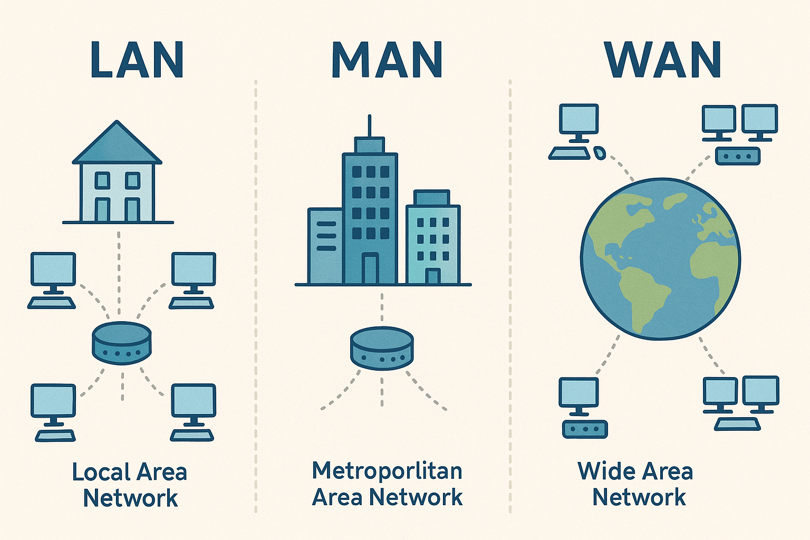

# Classificação por Abrangência Geográfica

### LAN (Local Area Network)
É a rede local da sua casa ou escritório que conecta dispositivos em uma área geográfica limitada, como um prédio, sala comercial ou faculdade.

* **Características:** Alta velocidade, menor abrangência geográfica e baixa latência por conta da curta distância entre os dispositivos.

### MAN (Metropolitan Area Network)
As redes metropolitanas cobrem uma área maior que a LAN, geralmente abrangendo cidades, bairros e complexos industriais. Elas são formadas pela interligação de múltiplas LANs em uma determinada região.

* **Características:** Cobre uma área geográfica maior que uma LAN. A velocidade costuma ser média e a latência aumenta por conta das distâncias maiores entre os pontos.

### WAN (Wide Area Network)
A rede WAN (cujo maior exemplo é a própria internet) é responsável por conectar múltiplas redes através de longas distâncias, abrangindo estados, países e continentes.

* **Características:** Cobre uma área geográfica de nível CONTINENTAL. A velocidade pode variar dependendo da tecnologia usada, e a sua latência costuma ser bem maior que a das outras duas redes exatamente por conta da imensa abrangência geográfica.

---
