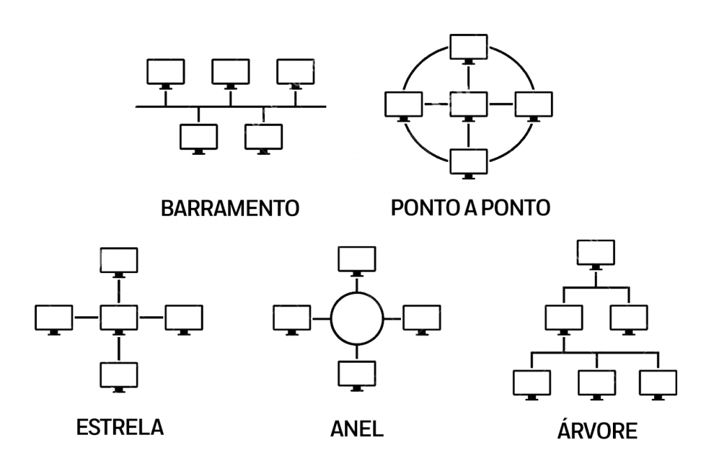

# Tipos de Topologia de Rede

### Topologia em Estrela (Star)
* **Como funciona:** Todos os equipamentos (PC, impressora, celular) se conectam a um equipamento central, que hoje em dia é um switch ou um roteador.
* **A vantagem:** Se um computador queimar ou o cabo apresentar defeito, só ele cai. A rede não vai sofrer danos por isso e continua operando para o resto.
* **A desvantagem:** Se o equipamento central (switch/roteador) queimar ou travar, a rede inteira vai parar de funcionar.

### Topologia em Malha (Mesh)
* **Como funciona:** Os roteadores/repetidores se conectam uns aos outros e formam uma malha completa, ou seja, todo mundo está conectado a todo mundo.
* **A grande vantagem:** Tolerância a falhas. Se um cabo de fibra ótica romper ou um desses roteadores queimar, a rede não vai parar de funcionar, pois os dados encontrarão outras rotas através dos roteadores que continuam ativos.
* **O ponto fraco:** É muito caro e complexo montar uma malha física. Por isso, ela é mais usada em estruturas muito grandes ou de forma lógica/wireless.

### Topologia Mista (Híbrida)
* **Como funciona:** É a junção de diferentes modelos, e é exatamente como a internet funciona hoje em dia. Na nossa casa, usamos uma rede em **Estrela** que se conecta no provedor, que por sua vez se conecta à internet global, que funciona como uma **Malha**.

---

### Menções Honrosas (O "Museu" da TI)

* **Barramento (Bus):** Todo mundo ligado em um único cabo reto de ponta a ponta. Se duas pessoas tentassem mandar dados ao mesmo tempo, dava colisão e o pacote corrompia. Se o cabo partisse no meio, a rede toda parava.
* **Anel (Ring):** Os PCs formavam um círculo fechado. Os dados viajavam em uma direção só. Apenas quem estivesse segurando um "bastão" lógico (o Token) podia transmitir dados. Era lento e muito difícil de dar manutenção.

---
